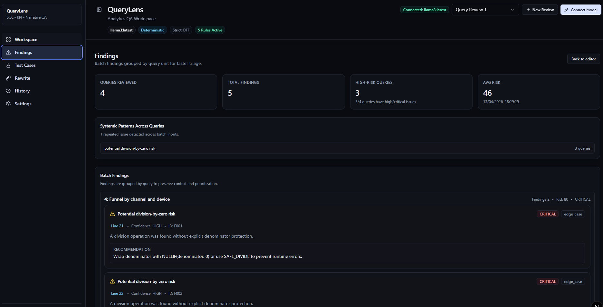
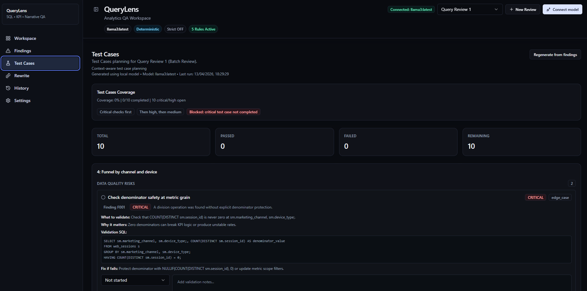
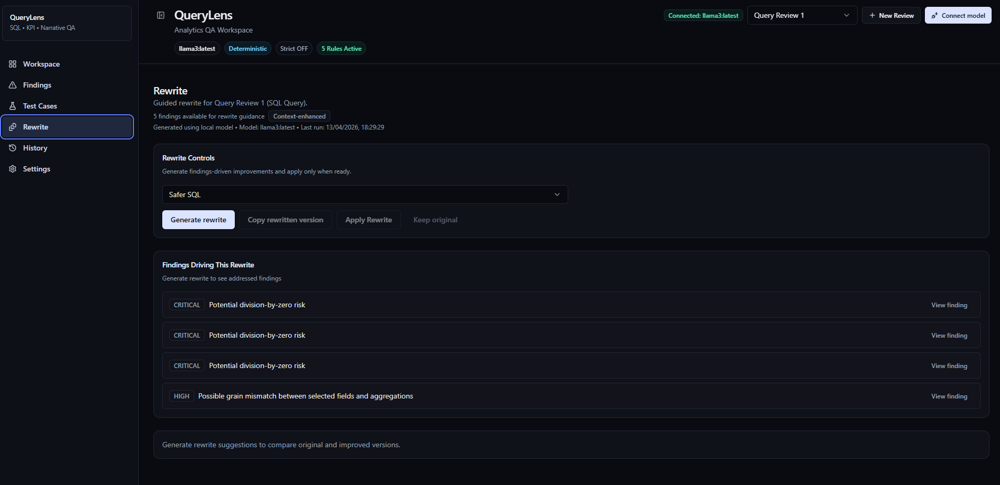
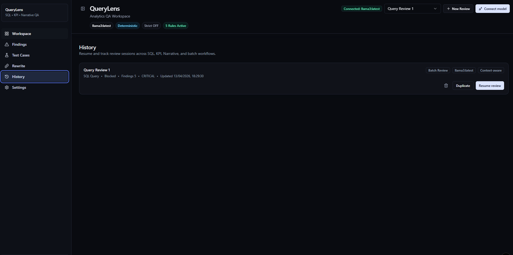
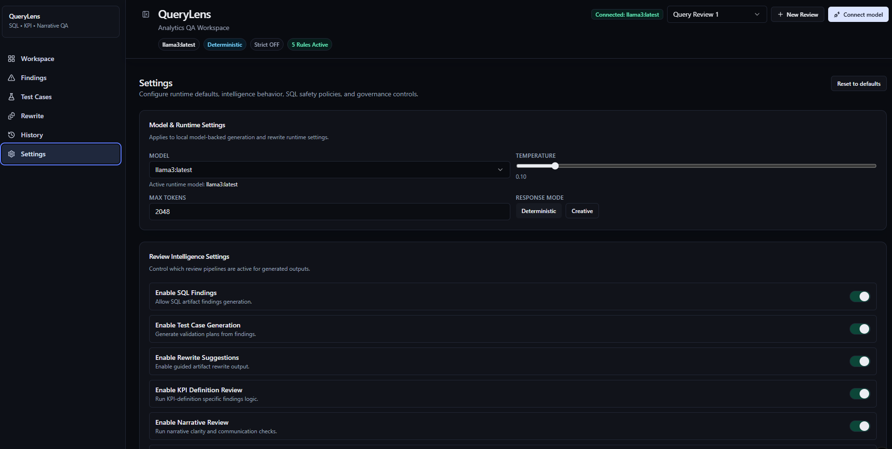

# QueryLens

**Local-first analytics QA workspace for SQL, KPI definitions, narratives, and batch review.**

QueryLens is a review system for analytics artifacts before they ship to dashboards, stakeholder updates, and decision workflows. It focuses on logic safety, metric clarity, and communication quality, not just whether a query runs.  
All model-assisted generation runs through local Ollama models, so teams can keep sensitive analytics logic and context inside their environment.

## Why This Project Exists

In real analytics workflows, many issues are discovered too late:
- SQL executes, but output logic is unsafe (grain mismatch, risky joins, denominator edge cases)
- KPI definitions are ambiguous at signoff time (scope, denominator, source-of-truth gaps)
- Narratives are directionally correct but weak for decision-making (missing quantification, vague recommendations)

QueryLens was built to add a practical QA layer before release, so analytics outputs are decision-safe, testable, and easier to trust.

## Screenshots

### 1) Workspace Overview
*Main review workspace with artifact input, session context, and risk summary in one operating view.*


### 2) Findings Overview
*Structured findings grouped by query unit for faster triage and risk prioritization.*


### 3) Test Cases Overview
*Validation plan generated from findings, with coverage and status tracking.*


### 4) Rewrite Overview
*Guided remediation panel to generate safer, clearer artifact revisions.*


### 5) History Overview
*Session history for resuming prior reviews and tracking review state over time.*


### 6) Settings Overview
*Runtime, intelligence, and safety controls for consistent QA behavior.*


## Who This Is For

- Analytics engineers and BI developers reviewing SQL before dashboard release
- Data analysts validating KPI definitions before stakeholder approval
- Data leads and product analysts preparing clear, evidence-backed narratives
- Teams running recurring reporting cycles that need repeatable QA standards

## What QueryLens Does

### Multi-artifact review
- Reviews **SQL Query**, **Batch Review**, **KPI Definition**, and **Narrative** artifacts
- Uses a unified findings structure with severity and confidence

### Findings and risk detection
- Surfaces logic and quality risks with structured output
- Supports context-aware reasoning using optional schema/data metadata

### Validation planning
- Generates actionable test cases tied to findings
- Tracks validation status and release readiness signals

### Guided remediation
- Generates rewrite suggestions grounded in detected issues
- Supports safer SQL patterns and clearer KPI/narrative wording

### Session-based workflow
- Creates and tracks review sessions with status/history
- Supports reruns and iterative review loops without losing context

## Review Workflow

1. **Create or select a review session**
2. **Choose artifact type** (SQL, KPI, Narrative, or Batch)
3. **Add optional data context** (schema/data metadata)
4. **Run analysis** to generate structured findings
5. **Review generated test cases** to validate key risks
6. **Use guided rewrites** to improve the artifact
7. **Rerun and compare** until release readiness is acceptable

## Example Risks QueryLens Can Surface

- Division-by-zero risk in metric formulas
- Join duplication and row multiplication risk
- Grain mismatch between selected fields and aggregations
- Ambiguous metric scope or denominator definition
- Missing narrative quantification, weak recommendations, unclear confidence

## What Makes QueryLens Different

QueryLens is not a generic SQL editor, formatter, or chat wrapper.

- It is built around **analytics QA workflow**, not one-off query edits
- It evaluates **business logic risk** and **metric-definition quality**, not just syntax
- It includes **narrative review** for decision communication quality
- It combines **Findings → Test Cases → Rewrite** as one connected process
- It is **local-first** with Ollama, supporting privacy-conscious analytics teams

## Why Local-First Matters

Analytics artifacts often contain sensitive business logic, metric definitions, and release context.  
Running generation through local models helps reduce exposure risk while still enabling assisted QA workflows.

## Example Use Cases

- **Pre-release SQL QA** for production dashboards and metrics layers
- **KPI definition review** before stakeholder or leadership signoff
- **Narrative QA** for release notes, RCA summaries, and decision updates
- **Batch review** of recurring SQL packs before scheduled reporting cycles

## Local-First AI Setup (Ollama)

1. Install Ollama: https://ollama.com  
2. Pull a local model:
   ```bash
   ollama pull llama3
   ```
3. Run the model:
   ```bash
   ollama run llama3
   ```
4. (Optional) Run service mode:
   ```bash
   ollama serve
   ```
5. In QueryLens, use **Connect model** and select the local model.

## Installation

```bash
git clone https://github.com/arisettynithin-maker/Query-Lens.git
cd Query-Lens
npm install
```

Optional environment setup:

```bash
cp .env.example .env.local
```

## Run Locally

```bash
npm run dev
```

Open: `http://localhost:3000`

Optional checks:

```bash
npm run lint
npm run typecheck
npm run build
```

## Architecture at a Glance

- **Frontend/UI:** Next.js App Router + React + TypeScript
- **Design system:** Tailwind CSS + Radix UI primitives
- **Editor:** Monaco Editor
- **Review logic:** Rule-based analyzers and orchestrator in `src/lib`
- **State/workflow:** Session-aware review state and history
- **Model runtime:** Local Ollama integration

## Repository Structure

```text
src/
  app/                 # routes and app shell
  components/          # workflow and UI components
    findings/
    history/
    layout/
    ollama/
    review/
    rewrite/
    settings/
    test-cases/
    workspace/
  lib/                 # analyzers, orchestrator, generation logic, utilities
  types/               # shared domain and UI types
examples/              # sample SQL/KPI/narrative/context inputs
docs/screenshots/      # README screenshots
public/                # static assets
```

## Roadmap

- Exportable QA reports for release documentation
- Deeper rule coverage for SQL and KPI edge cases
- Stronger cross-query pattern detection in batch reviews
- Improved governance controls and review policy templates
- Optional metadata connectors for richer context inputs

## Author

Nithin Arisetty
