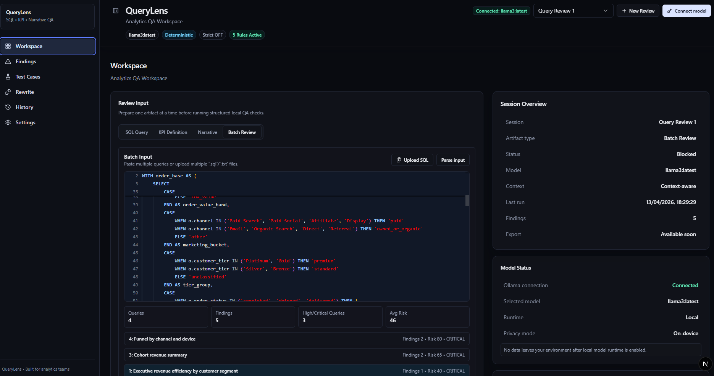
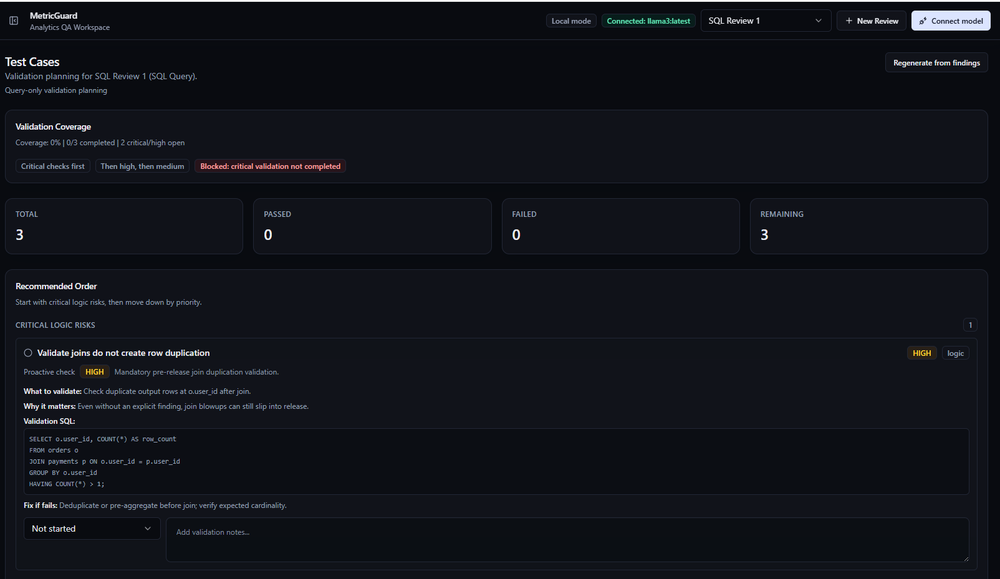
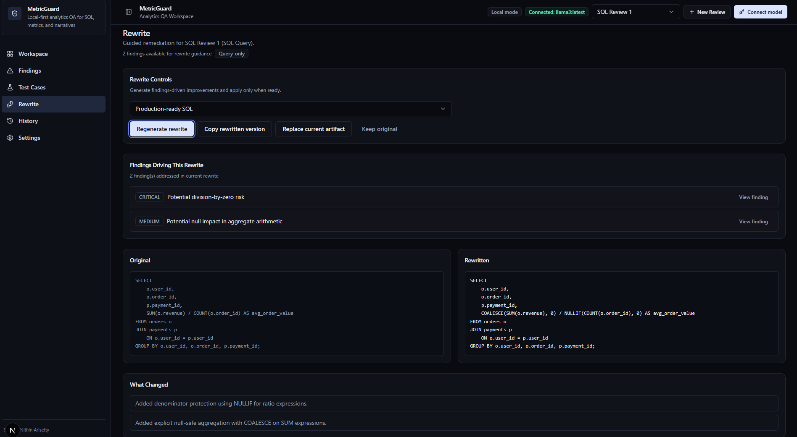
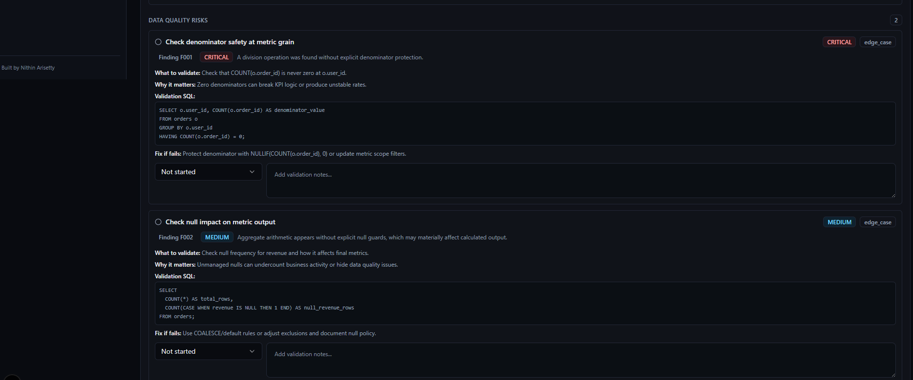
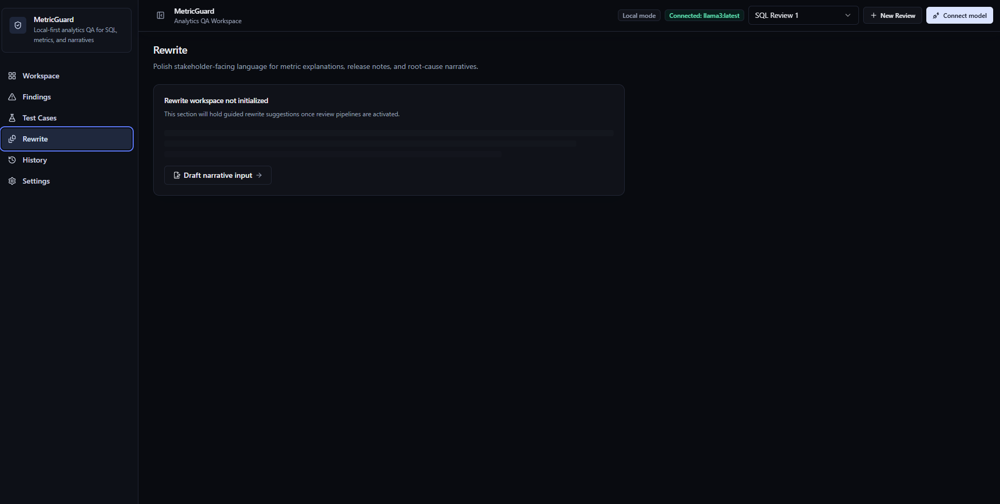
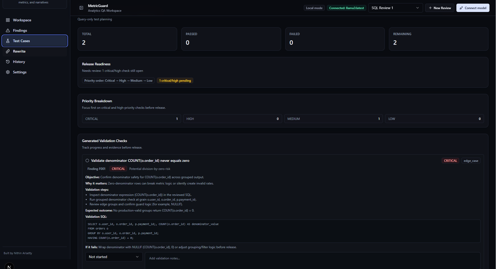
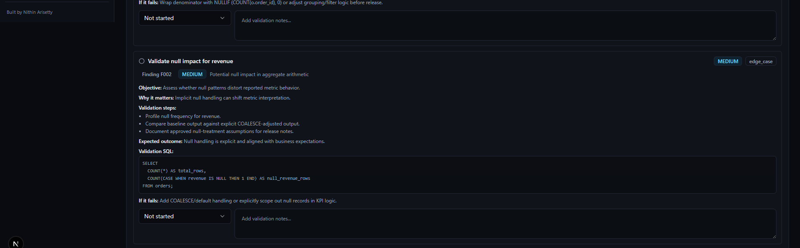

# QueryLens

Local-first analytics QA workspace for SQL, KPI definitions, narratives, and batch review.

## Product Overview
QueryLens helps analytics teams catch logic and communication risks before dashboards, releases, and business decisions go live. It combines findings, validation planning, and guided rewrites in one review workflow.

## Screenshots / Demo

### 1. Workspace overview


### 2. Test cases overview


### 3. Release readiness summary


### 4. Critical denominator validation


### 5. Null impact validation


### 6. Rewrite workspace


### 7. Rewrite empty state


## Why I Built This
In many analytics workflows, teams validate whether SQL runs, but not whether it is decision-safe. Production issues often come from join duplication, denominator risk, ambiguous KPI definitions, and weak stakeholder narratives. QueryLens was built to add a practical QA layer before reporting is shipped.

## Core Features
- Multi-artifact review: SQL Query, KPI Definition, Narrative, and Batch Review
- Rule-based findings with structured severity and confidence
- Context-aware analysis using optional schema/data context
- Session-based workflow with history, status, and rerun support
- Test case generation linked to findings
- Guided rewrite suggestions grounded in findings
- Local model integration through Ollama

## How It Works
1. Create or open a review session.
2. Add artifact input (SQL, KPI definition, narrative, or batch SQL).
3. Optionally add schema/data context.
4. Connect a local model with Ollama.
5. Run review to generate findings.
6. Use Test Cases to plan validation checks.
7. Use Rewrite to apply guided fixes.

## Local-First AI Setup with Ollama
1. Install Ollama: https://ollama.com
2. Pull a model:

```bash
ollama pull llama3
```

3. Run the model locally:

```bash
ollama run llama3
```

4. (Optional) Start Ollama service mode:

```bash
ollama serve
```

5. In QueryLens, click **Connect model** and select your local model.

## Installation
```bash
git clone <your-repo-url>
cd querylens
npm install
```

Optional environment overrides:

```bash
cp .env.example .env.local
```

## Running Locally
```bash
npm run dev
```

Open `http://localhost:3000`.

Optional checks:

```bash
npm run lint
npm run typecheck
npm run build
```

## Example Use Cases
- Validate a release SQL query for join duplication and denominator safety.
- Review KPI definitions for grain, scope, and source-of-truth clarity.
- QA stakeholder narratives for quantified impact and actionable recommendations.
- Run batch checks across multiple SQL queries before a dashboard release.

## Tech Stack
- Next.js (App Router)
- React + TypeScript
- Tailwind CSS
- Radix UI primitives
- Monaco Editor
- Local Ollama runtime

## Repository Structure
```text
src/
  app/                 # routes and app shell
  components/          # UI and workflow components
    findings/
    history/
    layout/
    ollama/
    review/
    rewrite/
    settings/
    test-cases/
    workspace/
  lib/                 # analyzers, orchestrator, utilities
  types/               # shared types
public/                # static assets
examples/              # sample SQL/KPI/narrative/context inputs
docs/screenshots/      # README screenshot assets
```

## Current Capabilities
- Session-based QA workflow with active session switching
- Artifact-aware review orchestration
- Structured findings across SQL, KPI, narrative, and batch flows
- Test case generation with status tracking
- Rewrite suggestions with safety rationale
- Optional data context for improved precision

## Roadmap
- Exportable QA reports
- Team collaboration workflows
- Deeper SQL parser coverage and rule expansion
- Optional warehouse metadata connectors
- Quality scoring and trend tracking across sessions

## Author
Nithin Arisetty
